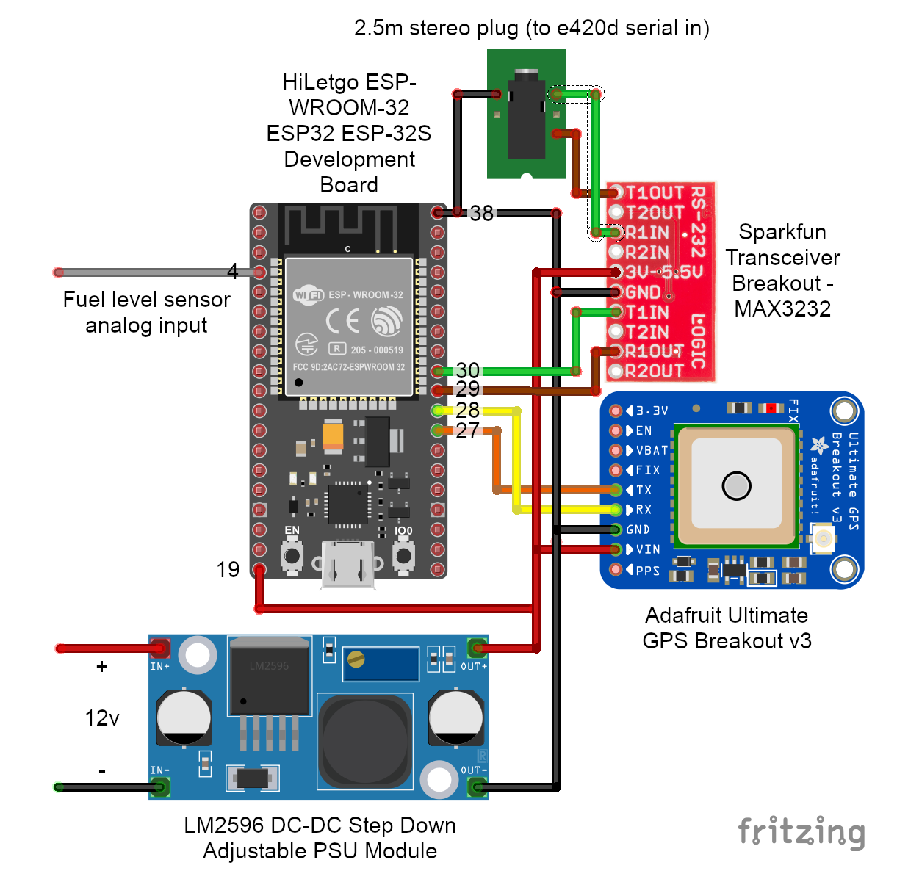

# Adaptronic-e420d-ESP32-Data-Dash

Ardunio sketch for ESP32 that reads data from an Adaptronic e420d ECU. This is achieved by sending MODBUS read register requests through a Sparkfun MAX3232 RS232 to TTL board connected to the e420d serial out 2.5mm socket. GPS data is read from an Adafruit Ultimate GPS Breakout. Fuel tank level read via analogue input. ESP32 creates a WiFi hotspot and HTTP server that serves JSON data when requested. Dashboard HTML file can be run on any device with a web browser connected to the ESP32 hotspot to request and render dashboard guages (currently using a 7" Android tablet).

# Wiring

# Todo

* Log data
* Display logged data
* Create immobilizer with fuel cut
